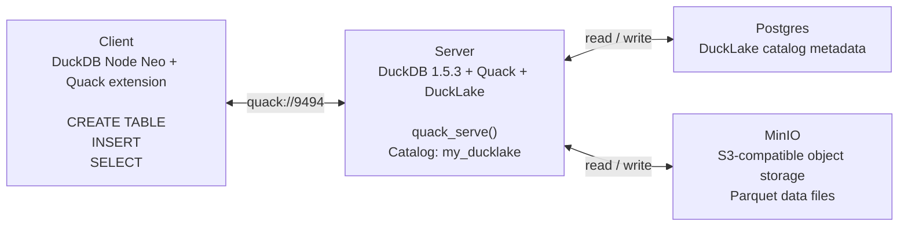

# e2e-ducklake

This repository is a demonstration of end-to-end testing with Quack, DuckLake, and DuckDB `1.5.3`.

The goal is simple: stand up a small DuckDB-based data platform, connect to it through Quack, write data into DuckLake, and verify that the full read/write path works end to end.

## Architecture



## Stack

- Client: DuckDB Node Neo via `@duckdb/node-api` `1.5.3-r.1`
- Server: DuckDB `1.5.3`
- Extensions: `quack`, `ducklake`, `postgres`, `httpfs`
- Metadata catalog: Postgres
- Object storage: MinIO
- Orchestration: Docker Compose

## What This Demo Validates

1. The server loads DuckDB `1.5.3` with `quack` and `ducklake`.
2. DuckLake attaches to a Postgres catalog and S3-compatible storage.
3. Quack exposes that DuckDB server on port `9494`.
4. A separate DuckDB consumer connects remotely through Quack.
5. The consumer runs `CREATE TABLE`, `INSERT`, and `SELECT`.
6. The returned rows confirm the end-to-end test path is working.

## Project Layout

- [docker-compose.yml](docker-compose.yml): full stack wiring for MinIO, Postgres, Quack server, and consumer
- [quack-server/server_init.py](quack-server/server_init.py): starts DuckDB `1.5.3`, loads extensions, configures the scoped S3 secret for MinIO, attaches DuckLake, and serves Quack
- [duckdb-consumer/query_worker.mjs](duckdb-consumer/query_worker.mjs): Node Neo client that connects through Quack and executes the e2e validation query flow
- [duckdb-consumer/bulk_insert_test.mjs](duckdb-consumer/bulk_insert_test.mjs): bulk-write test for forcing a larger DuckLake object-storage write

## Run

```bash
docker compose up --build
```

After startup, the consumer will:

- connect to `quack-server:9494`
- create `my_ducklake.main.orders` if it does not already exist
- insert a sample row
- read the table back and print the results

## Bulk Write Test

To test a larger write that materializes a real DuckLake data file in MinIO (bypassing DuckLake's data inlining for small writes), run:

```bash
docker cp duckdb-consumer/bulk_insert_test.mjs duckdb_quack_client:/app/bulk_insert_test.mjs
docker exec duckdb_quack_client node /app/bulk_insert_test.mjs
```

This script:

- clears the `orders` table
- inserts `50000` rows through Quack
- prints the final row count and ID range

This bulk write is necessary to force DuckLake to write data to object storage (MinIO) rather than keeping it inline in the catalog.

Expected result:

- DuckLake metadata registers a Parquet data file
- MinIO shows objects under `healthcare-lake/my_ducklake_data/main/orders`

The current verified bulk test result in this repo created a DuckLake data file with `50000` rows.

## Notes

- This repo is intentionally minimal and focused on demonstration, not production hardening.
- Small writes may remain inline in the DuckLake catalog, so they will not immediately appear in MinIO.
- Larger writes, such as the included bulk test, create object-backed Parquet files under the configured DuckLake `DATA_PATH`.
- Re-running the stack may produce duplicate sample rows unless you clear the backing storage and metadata first.
