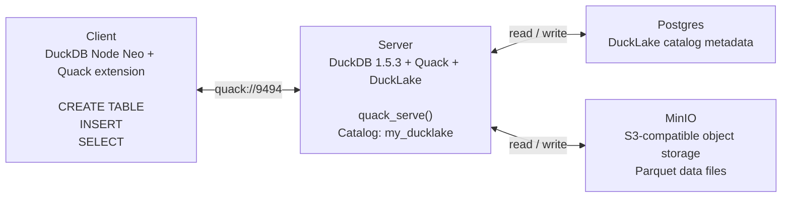

# e2e-ducklake

This repository is a demonstration of end-to-end testing with Quack, DuckLake, and DuckDB `1.5.3`.

The goal is simple: stand up a small DuckDB-based data platform, connect to it through Quack, write data into DuckLake, and verify that the full read/write path works end to end.

## Architecture



## Stack

- Client: DuckDB Node Neo via `@duckdb/node-api` `1.5.3-r.1`
- Server: DuckDB `1.5.3`
- Extensions: `quack`, `ducklake`, `postgres`, `httpfs`
- Metadata catalog: Postgres
- Object storage: MinIO
- Orchestration: Docker Compose

## What This Demo Validates

1. The server loads DuckDB `1.5.3` with `quack` and `ducklake`.
2. DuckLake attaches to a Postgres catalog and S3-compatible storage.
3. Quack exposes that DuckDB server on port `9494`.
4. A separate DuckDB consumer connects remotely through Quack.
5. The consumer runs `CREATE TABLE`, `INSERT`, and `SELECT`.
6. The returned rows confirm the end-to-end test path is working.

## Project Layout

- [docker-compose.yml](/Users/administrator/Documents/Labs/e2e-ducklake/docker-compose.yml:1): full stack wiring for MinIO, Postgres, Quack server, and consumer
- [quack-server/server_init.py](/Users/administrator/Documents/Labs/e2e-ducklake/quack-server/server_init.py:1): starts DuckDB `1.5.3`, loads extensions, attaches DuckLake, and serves Quack
- [duckdb-consumer/query_worker.mjs](/Users/administrator/Documents/Labs/e2e-ducklake/duckdb-consumer/query_worker.mjs:1): Node Neo client that connects through Quack and executes the e2e validation query flow

## Run

```bash
docker compose up --build
```

After startup, the consumer will:

- connect to `quack-server:9494`
- create `my_ducklake.main.orders` if it does not already exist
- insert a sample row
- read the table back and print the results

## Notes

- This repo is intentionally minimal and focused on demonstration, not production hardening.
- Re-running the stack may produce duplicate sample rows unless you clear the backing storage and metadata first.
